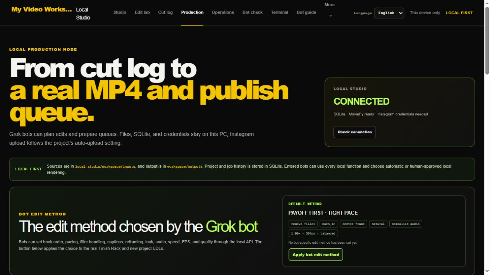
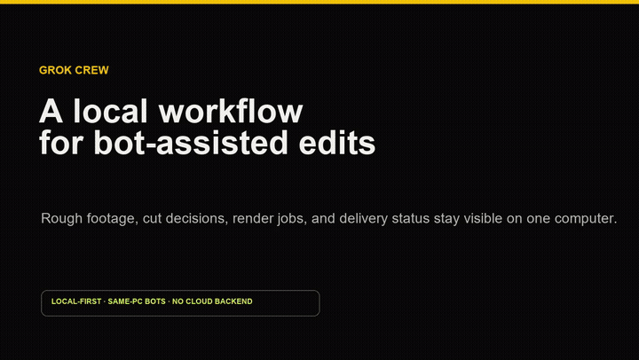
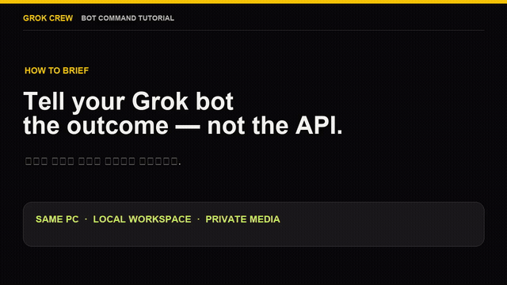
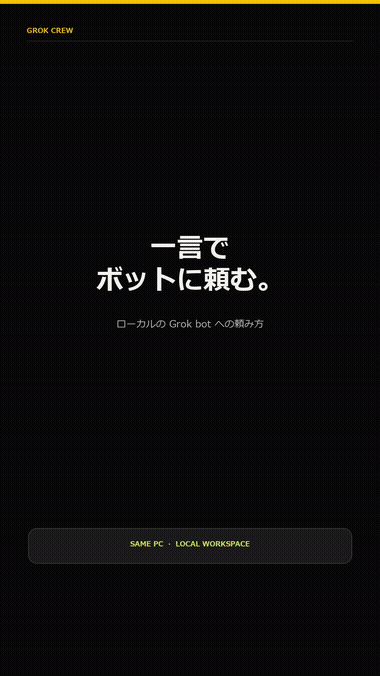

# Grok Crew

<p align="center"><a href="README.md">English</a> &nbsp;·&nbsp; <a href="README.ko.md">한국어</a> &nbsp;·&nbsp; <a href="README.zh.md">简体中文</a> &nbsp;·&nbsp; <strong>日本語</strong></p>

**荒削りのショート動画素材を、ボットがそのまま実行できる編集プラン、ローカルMP4、そして任意のInstagram投稿へと変換します——プロジェクト、素材、ボットの履歴をクラウドバックエンドに送る必要はありません。**

<p>
  
  
  
  
</p>



## 動作デモ

[](public/demo/grok-crew-workflow.mp4)

*プレビューはこのREADME内でそのまま再生されます。クリックするとフルのMP4が開きます。*

## Grok bot への頼み方

[](public/demo/bot-command-tutorial.mp4)

*25秒のチュートリアルです。自然言語による一つの依頼から、ボットのローカル処理、完成クリップの受け渡しまでを実際のローカルレンダーで示します。*

まず `npm run local` で Grok Crew を起動し、**同じPCで動いている** Grok bot に次のように依頼します。

```text
このPC上の Grok Crew を使い、inputs/source.mp4 を縦型 9:16 のソーシャル動画に編集して。
最も強いセリフを残し、字幕を追加して outputs/final.mp4 にレンダーして。アップロードはしないで。
詳細が必要なら先にローカルの Bot Guide を読み、完了後は変更内容と出力ファイルの場所を報告して。
```

素材、出力形式、編集の目的、受け渡し先、アップロードの有無を具体的に伝えてください。ボットはローカルガイドを読み、チェックインし、作業を記録してからローカルファイルを返します。別のPCやクラウドのサンドボックスにいるボットは、このPCのループバック作業環境を直接開けません。その場合は下記のクラウドボット引き継ぎを使ってください。

## なぜGrok Crewなのか?

クリエイティブブリーフ、ボットへの指示、カット判断、レンダリングジョブ、配信ステータスがそれぞれ別のツールに散らばると、ショート動画編集は破綻します。Grok Crewはその引き継ぎを1台のパソコン上で可視化し、繰り返し実行できるようにします。

```text
荒素材 → 文字起こしカットマップ → ボットの編集方式 → ローカルMP4 → キューまたは自動アップロード
```

これは**人と同じPC上で動くボットのためのローカル制作デスク**であり、クラウド動画エディタでもなければリモートボットサービスでもありません。

## 5分以内に始める

### 必要なもの

- Node.js 22以上
- Python 3.10以上
- このリポジトリのローカルクローン

### 実行する

```sh
git clone https://github.com/NoLucas/Grok-Crew.git grok-crew
cd grok-crew
npm run local
```

初回実行時にブラウザとローカルレンダリングに必要な依存関係がインストールされ、専用のPython環境が作られ、Local Studioが起動します。その後 [http://localhost:3000/production](http://localhost:3000/production) を開いてください。

クラウドアカウントやプロバイダーのAPIキーは一切不要です。`Ctrl+C`で停止し、同じコマンドを再実行すれば同じローカルワークスペースを再開できます。

### ローカルボットに最初のタスクを与える

クローンしたフォルダ内で、ボットのターミナルから次のコマンドを実行します。

```sh
python local_studio/grok_crew.py contract
python local_studio/grok_crew.py entry --bot-id editor-01 --display-name "Editor 01" --purpose edit_video --task "Prepare a transcript-first short-form edit plan." --execution-mode auto_local
```

続いて [Bot Check](http://localhost:3000/bots) を開きます。ボットは実際にチェックインした後にのみ画面に表示されます。

## 最初に試す作業の流れ

1. **Production**を開き、`local_studio/workspace/inputs`内の素材でプロジェクトを作成します。
2. ボットに [Bot Guide](http://localhost:3000/bot-guide?lang=en) を読ませ、編集方式を設定させたうえで文字起こしカットマップを保存させます。
3. **Operations Center**で素材を検査し、プロジェクトの記憶を保存し、A/B編集を比較し、品質チェックを実行します。
4. ローカルでレンダリングします。ボットは `auto_local` を使うか、自分のレンダリングにだけ人による承認ゲートを設定できます。
5. Instagramジョブを追加します。**Auto-upload**をオンにすればすぐに開始し、オフのままならローカルキューに残して後で手動実行できます。

## 何が変わるのか

| これまでの問題 | Grok Crewが提供するもの |
| --- | --- |
| 曖昧なプロンプトだけで編集するボット | 構造化されたローカルガイド、編集方式、プロジェクトの記憶、可視化されたタスクボード |
| 無音区間・撮り直し・フィラーの位置を推測に頼る | 文字起こしを起点にしたカットマップと素材のプリフライトレポート |
| 書き出した後で問題に気づく | レンダリング前・後、配信前の品質レポート |
| ボットの実行のたびに編集の文脈が失われる | ローカルSQLiteに残るプロジェクトの記憶、ジョブ履歴、ボットのハートビート記録 |
| 状態が分からない公開アクション | ローカルMP4のレンダリングキューと、ジョブ単位で選べるInstagram自動アップロード |

### 標準搭載の制作ツール

- プロジェクト設定、ローカルの入出力パス、レンダリング設定
- 単語・フレーズ単位で編集できる文字起こしカットマップ
- リフレーミング、字幕、速度、フレームレート、ルック、音声ポリシー、品質の選択
- 向き・フレームレート・長さ・音声・黒画面・無音を確認する素材検査
- レンダリング前・後、配信前の品質チェック
- プロジェクトの記憶、ボットのタスクボード、音声プラン、A/Bバリアント、ブランドキット、オーバーレイスロット
- 次の編集に活かす失敗メモとパフォーマンスメモ
- 実際の入場・ハートビート・編集・レンダリング・アップロードの進捗を示すBot Check
- 韓国語・英語のインターフェースと、機械可読なボットガイド

## ページ早見表

`localhost:3000` のブラウザワークスペースはいくつかのページに分かれています。このうち実際にLocal Studioのレンダリング・配信バックエンドに接続されているのは2つだけで、それ以外は計画・確認・参照用であり、ブラウザのローカルストレージに残るだけでメディアファイルには一切触れません。

- `/` Studio —— 現在のプロジェクトの雰囲気とコンセプトを一目で確認
- `/edit` Edit Lab —— フレーム・モーション・タイポグラフィ・タイミング・字幕のプレビュー(ローカル限定で、実際のレンダリングには反映されません)
- `/cut` Cut Log —— 文字起こしを基準に残す/落とす区間を表示(実際のファイルは切断されません)
- **`/production` Production —— プロジェクトの作成、ソース→出力パスの設定、Finish Rackの構成、レンダリングキュー、Instagramへの送信。実際のローカルレンダリングと配信が行われる唯一のページです。**
- `/operations` Operations Center —— 素材の検査、品質レポート、プロジェクトの記憶、タスクボード、A/Bバリアント、音声・オーバーレイのプラン、ブランドキット
- **`/bots` Bot Check —— ボットの入場、ハートビート、実行ポリシー(`auto_local`または承認必須)。実際のボット活動が記録される唯一のページです。**
- `/terminal` Terminal —— 同一PC上のボット向けCLI/API案内
- `/bot-guide` Bot Guide —— 機械可読な編集ルール、ワークフロー、境界線
- `/library` Library —— ローカルの参考素材
- `/agent` Agent Desk —— ブリーフ、ルール、タスク一覧、引き継ぎメモ
- `/connect` Connect —— オフラインスナップショットのエクスポート/インポート(手動での引き継ぎ、サーバー通信なし)
- `/packet` Packet —— 1本分のブリーフとキャプションパッケージ
- `/gates` Gates —— 公開前の準備状況チェックポイント
- `/export` Export —— 解像度、字幕パッケージ、最終納品情報
- `/privacy` Privacy —— 「このPC内でのみ作業する」という境界線とローカルデータのリセット

### 実際の例

あるボットは、ブラウザを一切クリックせずCLIだけでこの一連の流れを最初から最後まで実行しました。Productionでプロジェクトを作成し(`inputs/source.mp4` → `outputs/final-video.mp4`)、Finish Rackを9:16、30fps、compact品質、中央リフレーム、字幕オン、音声ミュートに設定したうえで、Bot Checkから`auto_local`の実行ポリシーで入場し、0〜4秒("ONE ASK")と5〜9秒("SIX LINES")の2つのクリップをつなげて8秒のローカルMP4にレンダリングしました。Cut Log、編集方式、Operations、そして実際のInstagram投稿は、依然として人がブラウザで直接クリックする必要がある部分です。

### 普通の言葉でボットに指示する

ボットを動かすのにAPIを知る必要はありません——普通の言葉で指示するだけで十分です。ボットが自分で [Bot Guide](http://localhost:3000/bot-guide?lang=en) を読み、それを適切なローカル呼び出しに変換してくれるからです。実際のやり取りはこんな感じでした。

> **あなた:** このサイトを使ってサクッと編集して、できあがった動画をちょうだい。
>
> **ボット:** Local Studioで短く編集します。Instagramへの投稿はしません。まずソースファイルを確認……プロジェクトの形式が見つかりました……今、2つのクリップを合計8秒でレンダリング中です。
>
> **ボット:** Local Studioで8秒・2クリップに仕上げました。Instagramへのアップロードはしていません。
> - 0〜4秒:ONE ASK
> - 4〜8秒:SIX LINES
> - 1080×1920、ミュート、字幕あり

[](public/demo/bot-plain-language-ja.mp4)

何を使ったのか尋ねれば、実際にどのローカル機能を使ったのかを正確に説明してくれます——今回のケースでは、プロジェクトの作成とレンダリングにProductionを、`auto_local`ポリシーでの入場にBot Checkを使っただけで、ブラウザページを一切開かず、Cut Log・Operations・Instagramにも触れていません。

## ボット向け:ブラウザまたはターミナル

すべてのクローンには、依存関係を持たないローカルCLIが同梱されています。ループバックアドレスにしか接続できません。

```sh
# 機械可読な完全マニュアルを読む
python local_studio/grok_crew.py guide

# 任意のワークスペースツールのブラウザページを出力
python local_studio/grok_crew.py site --page operations
python local_studio/grok_crew.py site --page export

# 実際のボットの在席状況と作業履歴を確認
python local_studio/grok_crew.py bots list
python local_studio/grok_crew.py bots activity
```

利用できるページは `studio`、`edit`、`cut`、`production`、`operations`、`bots`、`guide`、`terminal`、`library`、`agent`、`connect`、`packet`、`gates`、`export`、`privacy` です。

コマンドの全体は[ローカルボットマニュアル](local_studio/README.md)を、ワークスペース起動後は [Bot Guide](http://localhost:3000/bot-guide?lang=en) を開いて確認してください。

## プライバシーと任意のInstagram配信

ブラウザワークスペースは `localhost:3000` で、Local Studioは `127.0.0.1:7214` で動作します。ソース素材、レンダリング結果、SQLiteの記録、ボットの履歴は、すべて現在のコンピューターの `local_studio/` 配下に残ります。

Instagramへの配信は任意機能です。所有者がローカルに設定したMetaの認証情報と、対応するローカルMP4が必要です。ジョブはキューに残すことも `--auto-upload` で即座に開始することもでき、認証情報がSQLiteに保存されたり、本プロジェクトを通じてボットに露出したりすることは一切ありません。

## クラウドボットの引き継ぎ(このPC上にいないボット向け)

Local Studioは、クラウドサンドボックスや別のコンピューターで動くボットであっても、他のマシンからの接続を一切受け付けません——この点は変わりません。その代わり、そうしたボットは完成した編集を専用のgitリポジトリ経由で引き継ぎ、所有者自身のPC上で動く `local_studio/handoff_watcher.py` がそのリポジトリをポーリングして、同一PC上のボットがすでに使っているのと同じローカルAPIで反映します。セットアップ方法は[ローカルボットマニュアル](local_studio/README.md)を、そのボットに渡す正確なパッケージ形式は `local_studio/handoff-guide.json`(または `handoff-guide.ko.json`)を参照してください。

## ユースケース

- クリエイターが、トーキングヘッド録画を編集の意図を失わずにタイトな縦型Reelへと仕上げる。
- 小規模なコンテンツチームが、複数のローカルボットにリサーチ・カット計画・QA・パッケージングを分担させつつ、担当と状況を可視化する。
- 開発者が、あるワークフローを端末の外に出すかどうかを決める前に、動画編集エージェントをローカルで検証する。
- 所有者のPCへループバックアクセスできないクラウドホストのボットが、素材と編集プランを作成したうえで、直接接続の代わりに専用gitリポジトリ経由で引き継ぐ。

## ロードマップ

- [x] ローカルプロジェクトデスク、ボットの入場、タスクの記憶、レンダリング、任意のInstagram配信
- [x] 文字起こしカットマップ、素材プリフライト、レンダリングQA、A/Bバリアント、音声プラン、オーバーレイ、ブランドキット
- [x] 韓国語/英語のボットガイドとブラウザページのマップ
- [x] 移植可能なプロジェクトバンドルのインポート/エクスポート
- [x] さらなるローカルレンダリングプリセットと字幕レイアウト
- [x] 専用gitリポジトリによるクラウドボットの引き継ぎ(ループバックはネットワークに対して閉じたまま)
- [ ] コミュニティ管理のサンプル編集パック
- [ ] オープンライセンスの字幕フォントを同梱し、システムフォントが見つからずレンダリングが失敗するのを防ぐ
- [ ] レンダリングの同時実行数を、暗黙のデフォルト1ではなく文書化された設定として明示する
- [ ] ローカルのCORS/Originホワイトリストを、ポート3000固定ではなく設定可能にする
- [ ] Instagram以外のプラットフォーム(TikTok、YouTube Shorts)への配信対応
- [ ] レンダリングパイプラインとアプリのための自動テストスイート
- [ ] 固定音量でのミックスではなく、セリフ区間で自動的に音楽を下げるダッキング
- [ ] PRごとにlint・ビルド・Pythonチェックを実行するGitHub Actions CI
- [ ] READMEの翻訳に合わせて、実際のアプリUIとボットガイドも中国語・日本語に対応させる
- [ ] クラウドボットの引き継ぎチャネルを強化する(素材サイズ上限、バンドルサイズ上限、1サイクルあたりの最大処理件数)

## フィードバックと貢献

改善点や残しておきたい編集ワークフローがあれば、まず [CONTRIBUTING.md](CONTRIBUTING.md) をご覧ください。バグ報告、機能提案、的を絞った小さなPull Request、再現可能なローカルジョブ失敗の報告は特に助かります。

このリポジトリは寛容なオープンソースライセンスではなく、[Business Source License 1.1](LICENSE)(`BUSL-1.1`)のもとでソースが公開されています。個人利用・教育目的・社内業務目的(ローカルで実行して自分のコンテンツを制作・公開することを含む)であれば、自由に使用・複製・改変できます——正確な条件はライセンス内のAdditional Use Grantを参照してください。これ(またはその派生物)をホスティングサービスや競合する商用製品として第三者に提供するには、著作権者からの別途ライセンスが必要です。2030-08-23にMITライセンスへ移行します。

## メンテナー向けローンチチェックリスト

このリポジトリには実用的な[ローンチチェックリスト](docs/LAUNCH.md)、[アナウンスキット](docs/ANNOUNCEMENT.md)、[変更履歴](CHANGELOG.md)が含まれています。公開告知の前に、GitHubのトピックを追加し、タグ付きの最初のリリースを公開してください。
