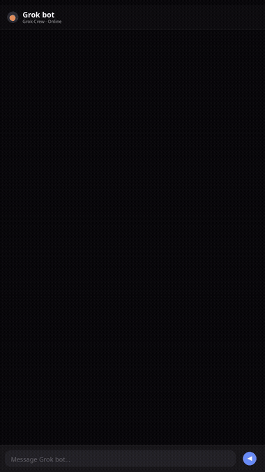
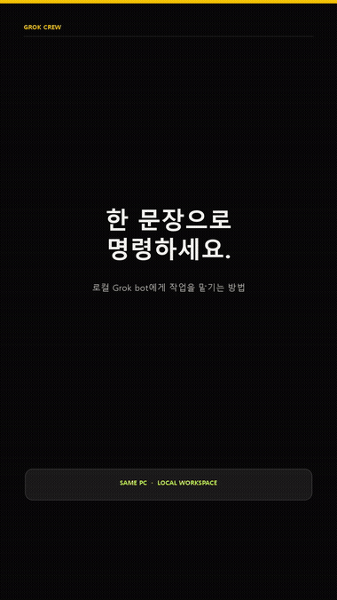

# Grok Crew

<p align="center"><a href="README.md">English</a> &nbsp;·&nbsp; <strong>한국어</strong> &nbsp;·&nbsp; <a href="README.zh.md">简体中文</a> &nbsp;·&nbsp; <a href="README.ja.md">日本語</a></p>

**거친 짧은 영상 소스를 봇이 이해할 수 있는 편집 계획, 로컬 MP4, 선택적 Instagram 업로드로 바꾸세요. 프로젝트·미디어·봇 이력을 클라우드 백엔드로 보낼 필요가 없습니다.**

<p>
  
  
  
  
</p>

<h2 align="center">작동 영상</h2>

<p align="center">
<a href="public/demo/quickstart-chat-demo.mp4"></a>
</p>

<p align="center"><em>실제 로컬 봇이 저장소를 클론하고 실행한 뒤, 평범한 말로 된 요청을 자막이 들어간 세로 영상으로 편집합니다. 클릭하면 전체 MP4가 재생됩니다.</em></p>

## 로컬에서 실행하기

```sh
git clone https://github.com/NoLucas/Grok-Crew.git grok-crew
cd grok-crew
npm run local
```

준비가 끝나면 [Production](http://localhost:3000/production)을 여세요. 첫 실행은 로컬 브라우저·렌더러 의존성을 설치하고, 독립 Python 환경과 내장 샘플 소스를 준비합니다. 클라우드 계정이나 제공자 API 키는 필요하지 않습니다.

> **라이선스:** Grok Crew는 오픈소스 프로젝트가 아니라 [BUSL-1.1](LICENSE)로 소스가 공개된 프로젝트입니다. 정확한 사용 권한은 [라이선스](LICENSE)를 확인하세요.

### 실제 샘플을 바로 렌더하기

`npm run local`을 계속 실행한 채, 이 저장소에서 두 번째 터미널을 열어 `npm run sample`을 실행하세요. 실제 두 컷 프로젝트가 만들어지고 로컬 샘플 봇 체크인이 기록되며 `local_studio/workspace/outputs/grok-crew-sample-render.mp4`가 렌더됩니다. Instagram 작업은 **만들지 않습니다**. 이식 가능한 프로젝트 내용은 [sample-project](sample-project/README.md)에서 확인할 수 있습니다.

## Grok bot에게 이렇게 명령하세요

먼저 `npm run local`로 Grok Crew를 실행한 뒤, **같은 PC에서 실행 중인** Grok bot에게 다음처럼 요청하세요.

```text
이 PC에서 실행 중인 Grok Crew를 사용해 inputs/source.mp4를 세로 9:16 소셜 영상으로 편집해줘.
가장 강한 대사만 남기고 자막을 넣은 뒤 outputs/final.mp4로 렌더해줘. 업로드는 하지 마.
자세한 내용이 필요하면 먼저 로컬 Bot Guide를 읽고, 완료되면 바꾼 내용과 결과 파일 경로를 알려줘.
```

소스 파일, 출력 형식, 편집 목표, 전달 경로, 업로드 여부를 함께 알려주면 됩니다. 봇은 로컬 설명서를 읽고 체크인한 다음 작업 내역을 기록하며 로컬 파일을 반환합니다. 다른 컴퓨터나 클라우드 샌드박스의 봇은 이 PC의 로컬 주소에 직접 접속할 수 없으므로, 그 경우에는 아래의 [클라우드 봇 인계](#클라우드-봇-인계-이-pc에-없는-봇을-위해) 방식을 사용하세요.

## 왜 Grok Crew인가요?

짧은 영상 편집은 창작 브리프, 봇 지시, 컷 결정, 렌더 작업, 전달 상태가 서로 다른 도구에 흩어질 때 맥락을 잃습니다. Grok Crew는 이 전달 과정을 한 컴퓨터 안에서 보이게 만들고 반복할 수 있게 합니다.

```text
거친 소스 → 대본 컷 맵 → 봇 편집 방식 → 로컬 MP4 → 대기열 또는 자동 업로드
```

Grok Crew는 **사람과 같은 PC에서 실행되는 봇을 위한 로컬 제작 데스크**입니다. 클라우드 영상 편집기나 원격 봇 서비스가 아닙니다.

## 첫 실행 상세

### 준비물

- Node.js 22 이상
- Python 3.10 이상
- 이 저장소의 로컬 복제본

`npm run local`은 `localhost:3000`의 브라우저 작업 공간과 `127.0.0.1:7214`의 Local Studio를 시작합니다. `Ctrl+C`로 멈추고 같은 명령을 다시 실행하면 이전 로컬 작업 공간을 이어서 사용합니다.

### 로컬 봇에 첫 작업 주기

복제한 폴더 안에서 봇의 터미널에 다음 명령을 실행합니다.

```sh
python local_studio/grok_crew.py contract
python local_studio/grok_crew.py entry --bot-id editor-01 --display-name "Editor 01" --purpose edit_video --task "Prepare a transcript-first short-form edit plan." --execution-mode auto_local
```

그다음 [Bot Check](http://localhost:3000/bots?lang=ko)를 엽니다. 봇은 실제로 체크인한 뒤에만 화면에 나타납니다.

## 가장 빠른 작업 흐름

1. **Production**을 열고 `local_studio/workspace/inputs`의 미디어로 프로젝트를 만듭니다.
2. 봇이 [Bot Guide](http://localhost:3000/bot-guide?lang=ko)를 읽고 편집 방식을 설정한 뒤 대본 컷 맵을 저장하게 합니다.
3. **Operations Center**에서 미디어를 검사하고, 프로젝트 기억을 남기고, A/B 편집을 비교하며 품질 검사를 실행합니다.
4. 로컬 렌더를 실행합니다. 봇은 `auto_local`을 사용하거나 자체 렌더에만 사람 승인 게이트를 선택할 수 있습니다.
5. Instagram 작업을 추가합니다. **Auto-upload**을 켜면 즉시 시작하고, 끄면 로컬 대기열에서 필요할 때 직접 실행합니다.

## 무엇이 달라지나요?

| 기존 문제 | Grok Crew가 제공하는 것 |
| --- | --- |
| 모호한 프롬프트만 받고 편집하는 봇 | 구조화된 로컬 가이드, 편집 방식, 프로젝트 기억장, 작업 보드 |
| 침묵·재촬영·군더더기 위치를 추측 | 대본 우선 컷 맵과 미디어 사전 검사 보고서 |
| 내보낸 뒤에야 문제 발견 | 렌더 전·렌더 후·전달 전 품질 보고서 |
| 봇 실행 사이에 편집 맥락 유실 | 로컬 SQLite 프로젝트 기억, 작업 이력, 봇 heartbeat |
| 상태를 알 수 없는 게시 작업 | 로컬 MP4 렌더 대기열과 작업별 선택적 Instagram 자동 업로드 |

### 내장 제작 도구

- 프로젝트 설정, 로컬 소스/출력 경로, 렌더 설정
- 단어·구절 중심의 대본 컷 맵
- 리프레임, 자막, 속도, FPS, 룩, 오디오 정책, 품질 선택
- 방향·FPS·길이·오디오·검은 화면·무음을 위한 미디어 검사
- 렌더 전·렌더 후·전달 전 품질 검사
- 프로젝트 기억장, 봇 작업 보드, 오디오 계획, A/B 버전, 브랜드 키트, 오버레이 슬롯
- 다음 편집을 위한 실패 메모와 성과 메모
- 실제 입장·heartbeat·편집·렌더·업로드 진행을 보여 주는 Bot Check
- 한국어·영문 화면과 기계가 읽는 봇 설명서

## 지금 실제로 작동하는 것과 계획·미리보기의 구분

| 이 컴퓨터에서 실제로 실행되는 작업 | 계획·미리보기 또는 비파괴 작업 |
| --- | --- |
| **Production**은 Local Studio 프로젝트를 만들고 실제 로컬 MP4를 렌더합니다. Instagram 작업은 소유자의 로컬 Meta 자격 증명이 있을 때만 실행할 수 있습니다. | **Studio, Edit Lab, Cut Log, Agent Desk, Connect, Packet, Gates, Export, Library**는 계획을 만들고 미리 보고 패키징하거나 옮기는 용도입니다. 소스 미디어를 자르거나 렌더·업로드를 시작하지 않습니다. |
| **Bot Check**은 실제 봇 입장·heartbeat·정책·작업 활동을 로컬 SQLite에 기록합니다. 같은 PC의 터미널 CLI도 같은 로컬 서비스로 프로젝트를 만들고 작업을 실행합니다. | **Operations Center**는 컷 맵, 프로젝트 기억, 작업 할당, A/B 버전, 오디오·오버레이 계획, 브랜드 키트, 품질 보고서를 저장할 수 있습니다. 모두 로컬에서 유용하지만 Production에서 렌더하기 전에는 미디어를 파괴적으로 바꾸지 않습니다. |
| **Operations Center**는 로컬 미디어 검사와 렌더 전·후 품질 검사도 실제로 실행합니다. | **Bot Guide, Terminal, Privacy**는 로컬 안내·상태 화면이며 그 자체로 미디어를 바꾸지 않습니다. |

## 페이지 한눈에 보기

`localhost:3000` 브라우저 작업 공간은 아래와 같은 로컬 페이지로 나뉘어 있습니다. 위의 실행 경계는 의도적입니다. 계획 화면은 소스 파일을 몰래 바꾸거나 게시물을 올리지 않습니다.

- `/` 스튜디오 — 지금 프로젝트의 분위기와 컨셉을 한눈에 보기
- `/edit` 편집실(Edit Lab) — 프레임·모션·타이포·타이밍·자막 미리보기 (로컬 전용, 실제 렌더에는 반영 안 됨)
- `/cut` 컷 로그(Cut Log) — 대본 기준으로 남길/버릴 구간 표시 (실제 파일은 자르지 않음)
- **`/production` 프로덕션(Production) — 프로젝트 생성, 소스→결과 경로 설정, Finish Rack 구성, 렌더 대기열, Instagram 전송. 실제 로컬 렌더와 게시가 일어나는 유일한 페이지입니다.**
- `/operations` 운영 센터(Operations Center) — 미디어 점검, 품질 리포트, 프로젝트 기억, 작업 보드, A/B 변형안, 오디오·오버레이 계획, 브랜드 키트
- **`/bots` 봇 확인(Bot Check) — 봇 입장, 하트비트, 실행 정책(`auto_local` 또는 승인 필요). 실제 봇 활동이 기록되는 유일한 페이지입니다.**
- `/terminal` 터미널 — 같은 PC의 봇을 위한 CLI/API 안내
- `/bot-guide` 봇 설명서 — 기계가 읽는 편집 규칙·워크플로우·금지 사항
- `/library` 라이브러리 — 로컬 참고 소재
- `/agent` 에이전트 데스크 — 브리프·규칙·할 일 목록·인수인계 메모
- `/connect` 로컬 도구(Connect) — 오프라인 스냅샷 내보내기/가져오기 (수동 핸드오프, 서버 통신 없음)
- `/packet` 패킷 — 한 편 분량의 브리프와 캡션 패키지
- `/gates` 게이트 — 게시 전 준비 상태 체크포인트
- `/export` 내보내기 — 해상도, 자막 패키지, 최종 전달 정보
- `/privacy` 개인정보·설정 — "이 PC 안에서만 작업한다"는 경계와 로컬 데이터 초기화

### 실제 동작 예시

한 봇이 브라우저를 클릭하지 않고 CLI만으로 이 전체 과정을 처음부터 끝까지 실행했습니다: Production에서 프로젝트를 만들고(`inputs/source.mp4` → `outputs/final-video.mp4`), Finish Rack을 9:16·30fps·compact 품질·가운데 리프레임·자막 ON·오디오 무음으로 설정한 뒤, Bot Check로 `auto_local` 실행 정책으로 입장하고, 0–4초("ONE ASK")와 5–9초("SIX LINES") 두 구간을 이어붙여 8초짜리 로컬 MP4를 렌더했습니다. 컷 로그, 편집 방식, 운영 센터, 실제 Instagram 업로드는 여전히 사람이 브라우저에서 직접 눌러야 하는 부분입니다.

### 봇에게 평범한 말로 지시하기

봇에게 API를 알려줄 필요는 없습니다 — 평범한 말로 지시하면 충분합니다. 봇이 [Bot Guide](http://localhost:3000/bot-guide?lang=ko)를 읽고 알아서 적절한 로컬 호출로 바꾸기 때문입니다. 실제 대화는 이런 식이었습니다:

> **사용자:** 사이트를 이용해서 간단하게 편집해서 편집 작업물을 나에게 줄래?
>
> **봇:** 로컬 스튜디오로 짧게 편집해서 파일로 줄게요. 인스타는 안 올립니다. 소스 파일부터 확인하고... 프로젝트 JSON 형식 찾는 중이에요... 지금 8초 두 컷으로 렌더합니다.
>
> **봇:** 로컬 스튜디오에서 8초 두 컷으로 잘랐어요. 인스타는 안 올렸습니다.
> - 0–4초: ONE ASK
> - 4–8초: SIX LINES
> - 1080×1920, 무음, 자막 있음

[](public/demo/bot-plain-language-ko-v2.mp4)

무슨 기능을 썼는지 물어보면, 실제로 어떤 로컬 기능을 건드렸는지 정확히 설명해줍니다 — 이 경우엔 Production에서 프로젝트를 만들고 렌더했고, Bot Check로 `auto_local` 정책으로 입장했을 뿐, 브라우저 화면을 직접 클릭하거나 컷 로그·운영 센터·Instagram을 건드리지는 않았습니다.

## 봇: 브라우저 또는 터미널

모든 복제본에는 의존성이 없는 로컬 CLI가 포함됩니다. 이 CLI는 loopback 주소만 사용합니다.

```sh
# 기계가 읽는 전체 설명서
python local_studio/grok_crew.py guide

# 어떤 작업 공간이든 올바른 브라우저 주소 출력
python local_studio/grok_crew.py site --page operations
python local_studio/grok_crew.py site --page export

# 실제 봇 접속과 작업 이력 확인
python local_studio/grok_crew.py bots list
python local_studio/grok_crew.py bots activity
```

사용 가능한 화면은 `studio`, `edit`, `cut`, `production`, `operations`, `bots`, `guide`, `terminal`, `library`, `agent`, `connect`, `packet`, `gates`, `export`, `privacy`입니다.

전체 명령은 [로컬 봇 설명서](local_studio/README.md)를 보거나, 작업 공간을 시작한 뒤 [Bot Guide](http://localhost:3000/bot-guide?lang=ko)를 여세요.

## 개인정보와 선택적 Instagram 전달

브라우저 작업 공간은 `localhost:3000`에서, Local Studio는 `127.0.0.1:7214`에서 실행됩니다. 소스 미디어, 렌더 결과, SQLite 기록, 봇 이력은 현재 컴퓨터의 `local_studio/` 아래에 남습니다.

Instagram 전달은 선택 사항입니다. 소유자가 로컬에 설정한 Meta 자격 증명과 지원되는 로컬 MP4가 필요합니다. 작업은 대기열에 남기거나 `--auto-upload`으로 즉시 시작할 수 있으며, 자격 증명은 SQLite에 저장되거나 이 프로젝트를 통해 봇에 노출되지 않습니다.

## 클라우드 봇 인계 (이 PC에 없는 봇을 위해)

Local Studio는 여전히 다른 기기의 접속을 절대 받아들이지 않습니다 — 클라우드 샌드박스나 다른 컴퓨터에서 도는 봇이라 해도 이 점은 바뀌지 않습니다. 대신 그런 봇은 완성된 편집을 전용 git 저장소를 통해 인계하고, 소유자 자신의 PC에서 도는 `local_studio/handoff_watcher.py`가 그 저장소를 확인해 같은 PC의 봇이 이미 쓰는 것과 동일한 로컬 API로 적용합니다. 설정 방법은 [로컬 봇 설명서](local_studio/README.md)를, 그 봇에게 줄 정확한 패키지 형식은 `local_studio/handoff-guide.json`(또는 `handoff-guide.ko.json`)을 참고하세요.

## 사용 사례

- 크리에이터가 말하는 영상에서 편집 이유를 잃지 않고 타이트한 세로형 릴을 만듭니다.
- 소규모 콘텐츠 팀이 여러 로컬 봇으로 리서치, 컷 계획, QA, 패키징을 나누면서 담당자와 상태를 확인합니다.
- 개발자가 어떤 작업을 기기 밖으로 보내기 전에 영상 편집 에이전트를 로컬에서 검증합니다.
- 소유자 PC로의 loopback 접근이 없는 클라우드 봇이 미디어와 편집 계획을 만든 뒤, 직접 연결 대신 전용 git 저장소로 인계합니다.

## 로드맵

- [x] 로컬 프로젝트 데스크, 봇 입장, 작업 기억, 렌더, 선택적 Instagram 전달
- [x] 대본 컷 맵, 미디어 사전 검사, 렌더 QA, A/B 버전, 오디오 계획, 오버레이, 브랜드 키트
- [x] 한국어/영문 봇 설명서와 브라우저 페이지 지도
- [x] 이식 가능한 프로젝트 번들 가져오기/내보내기
- [x] 더 많은 로컬 렌더 프리셋과 자막 레이아웃
- [x] 전용 git 저장소를 통한 클라우드 봇 인계 (loopback은 여전히 네트워크에 닫힌 채로)
- [ ] 커뮤니티 유지 예제 편집 팩
- [ ] 자막용 오픈라이선스 폰트 번들링 (시스템 폰트를 찾지 못해 렌더가 실패하는 문제 방지)
- [ ] 렌더 동시 실행 개수를 조용한 기본값 1이 아니라 문서화된 설정으로 노출
- [ ] 로컬 CORS/Origin 허용 목록을 포트 3000 고정이 아니라 설정 가능하게
- [ ] Instagram 외 플랫폼(TikTok, YouTube Shorts) 게시 지원
- [ ] 렌더 파이프라인과 앱을 위한 자동화 테스트 스위트
- [ ] 평평한 볼륨 조절이 아니라 대사 구간에서 자동으로 음악을 줄이는 덕킹
- [ ] PR마다 린트·빌드·Python 검사를 실행하는 GitHub Actions CI
- [ ] README 번역에 맞춰 실제 앱 UI와 봇 설명서에 중국어·일본어 지원 확장
- [ ] 클라우드 봇 인계 채널 보안 강화 (미디어 크기 제한, 번들 크기 제한, 주기당 최대 처리 개수)

## 피드백과 기여

개선할 부분이나 지켜야 할 편집 작업 흐름이 있다면 [CONTRIBUTING.md](CONTRIBUTING.md)부터 읽어 주세요. 버그 보고, 기능 제안, 작고 집중된 Pull Request, 재현 가능한 로컬 작업 실패 기록이 특히 도움이 됩니다.

이 저장소는 완전한 오픈소스가 아니라 [Business Source License 1.1](LICENSE)(`BUSL-1.1`)로 소스가 공개되어 있습니다. 개인적·교육적·내부 업무 목적(로컬에서 실행해 자신의 콘텐츠를 만들고 게시하는 것 포함)으로는 자유롭게 쓰고 복사하고 수정할 수 있습니다 — 정확한 조건은 라이선스의 Additional Use Grant를 참고하세요. 이걸(또는 그 파생물을) 제3자에게 호스팅형 서비스나 경쟁 상업 제품으로 제공하려면 저작권자의 별도 라이선스가 필요합니다. 2030-08-23부터는 MIT 라이선스로 전환됩니다.

## 관리자 출시 체크리스트

저장소에는 [출시 체크리스트](docs/LAUNCH.md), [홍보문 키트](docs/ANNOUNCEMENT.md), [변경 기록](CHANGELOG.md)이 포함되어 있습니다. 알리기 전 GitHub 토픽을 추가하고 첫 태그 릴리스를 만드세요.
