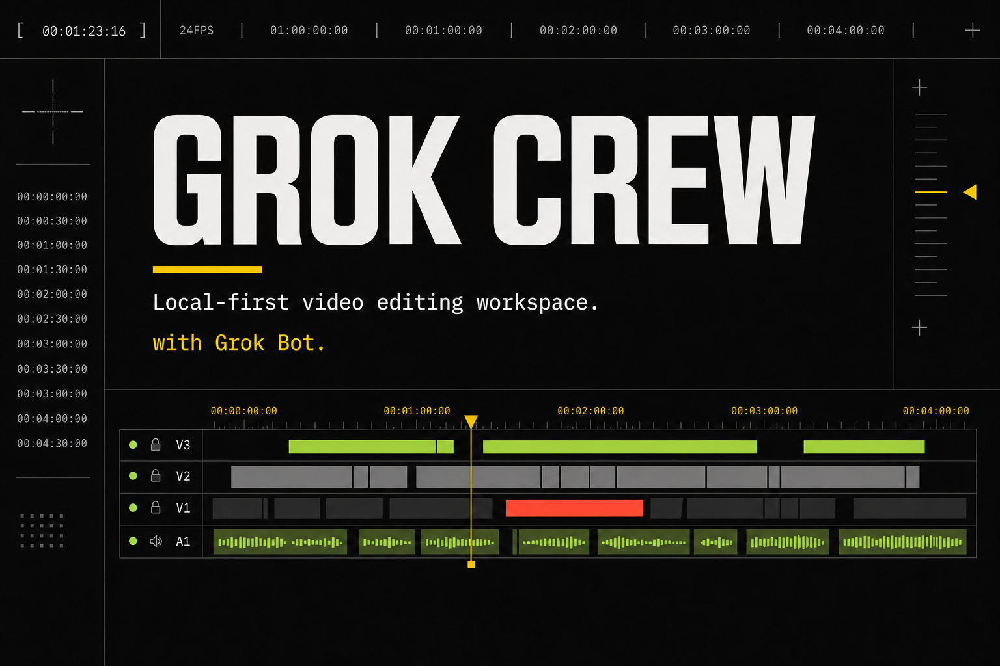

# Grok Crew

<p align="center">
  
</p>

**v1.0.0** · with Grok Bot · 지금 무료

쇼츠를 혼자 자르며 밤을 샐 필요 없습니다.
쓰던 **Grok Bot**이나 Agent를 붙이면, 다듬은 파일이 **이 PC 폴더**에 남습니다.
계정 없고, 카드 없고, 크레딧 없습니다. 받아서 엽니다.

[Windows 받기](https://github.com/NoLucas/Grok-Crew/releases/tag/v1.0.0) · [English](README.md) · [中文](README.zh.md) · [日本語](README.ja.md)

---

## 이 프로그램을 쓰는 이유

- **쇼츠 만들기가 힘들었던 사람을 위한 프로그램입니다.** 타임라인을 처음부터 짜지 않아도 됩니다. 하고 싶은 말을 적고, 봇 창에 붙여 넣은 뒤, 여기서 저장합니다.
- **지금은 무료입니다.** 로그인 칸이 없습니다. 구독이 아닙니다. 컷당 크레딧도 없습니다.
- **파일은 이 PC에 남습니다.** 클라우드 편집기가 아닙니다.

영상을 대신 만들어 주는 구독 서비스가 아닙니다. 쓰던 봇을 붙이는 프로그램입니다.

---

## 봇·에이전트 내장 스킬

연결할 때 역할에 맞는 스킬이 **이미 붙어 있습니다.** 기획·수집·편집 프롬프트를 따로 짤 필요가 없습니다.

| 자리 | 기본 스킬 | 함께 붙는 추가 스킬 |
|---|---|---|
| **Grok Bot / Agent 기획자** | `planner` — 오늘 할 말을 컷 계획으로 바꿉니다 | `edit-plan` — 수집·편집자가 읽는 짧은 계획서 |
| **Grok Bot / Agent 스크래핑** | `scraper` — 공개 페이지만 고릅니다 | `public-pick` — 로그인 벽이 있는 SNS는 적지 않습니다 |
| **Grok Bot / Agent 편집자** | `editor` — 계획대로 자릅니다 | `cut-to-plan` — 장면 순서와 나라별 버릇을 지킵니다 |

원문은 [`public/bot-skills/`](public/bot-skills/)에 있습니다. 연결 글을 복사하면 그 역할의 스킬이 함께 붙습니다. 이 프로그램은 사이트를 긁지 않습니다.

---

## 쓰는 순서

1. **Windows 받기**에서 설치하고 엽니다. 계정은 없습니다.
2. **연결**에서 쓰던 봇을 붙입니다. 붙일 글을 복사해 봇 창에 넣습니다.
3. **자동**에서 하고 싶은 말을 적고 **만들기**를 누릅니다.
4. 사람이 봇 창에 붙여 넣습니다. 이 창은 기다립니다.
5. 미리보기가 뜨면 **이 PC에 저장**합니다. 올리는 일은 그다음, 원할 때만.

연결이 안 되면 **연결** 칸이 고치는 방법을 알려 줍니다. 자동 칸을 먼저 열지 마세요.

---

## v1.0.0에서 달라진 것

예전 Grok-Crew(0.2.1)는 브라우저 작업대에 가까웠습니다. 지금 1.0.0은 **이 PC의 창**입니다.

- 연결 · 자동 · 설정 · 편집 · 내보내기가 같은 방식으로 적습니다. 할 일은 하나이고, 나머지는 칩입니다.
- **Grok Bot**과 **Agent**를 기획자·스크래핑·편집자로 붙입니다. 내장 스킬이 함께 붙습니다.
- 붙일 글만 복사합니다. 답장을 이 창에 다시 붙이지 않습니다. `127.0.0.1`을 봇에게 보여 주지 않습니다.
- 자막·더빙·TTS는 켠 것만 돌아갑니다. 기본값은 모두 꺼져 있습니다.
- 다듬은 파일은 이 PC에 남습니다. GitHub 편지함이 없어도 됩니다.
- 짝 코드는 암호학적으로 안전한 난수입니다. GitHub 토큰 오류 메시지에 토큰을 다시 보여 주지 않습니다.

자세한 목록은 [CHANGELOG.md](CHANGELOG.md)와 [릴리스 노트](docs/RELEASE_NOTES.v1.0.md)입니다.

---

## 화면에 있는 것

한 칸은 **지금 할 일 하나**입니다. 나머지는 칩을 눌러 엽니다.

| 칸 | 하는 일 |
|---|---|
| **연결** | 봇을 붙이거나 뗍니다. 이 PC에서 쓰기, 다른 창, 봇 없이 영상 열기는 접혀 있습니다. |
| **자동** | 하고 싶은 말을 한 칸에 적습니다. 칩: 화면 / 올릴 곳 / 소리. 만들기를 누른 뒤에는 기다림 → 미리보기 → 저장입니다. |
| **설정** | 형태·길이·소리·템포. 이 칸의 버튼은 **설정만 저장**입니다. |
| **편집** | 타임라인과 미리보기. 가져온 파일·프록시는 접혀 있습니다. |
| **내보내기** | 이 PC에 저장이 먼저입니다. 올리기·교환·기록은 칩입니다. |
| **고급 사양** | 제목과 목표. 스타일·원본·모으기·파일은 칩. 저장한 뒤에만 보낼함·받기가 열립니다. |

왼쪽 **버전 기록**, 오른쪽 GitHub·제작기는 접혀 있습니다. 손님이 연 뒤에만 보입니다.

---

## 이 프로그램이 아닌 것

- 클라우드 편집기, 브라우저에서 자르는 사이트
- “우리가 영상을 만들어 준다”는 구독
- 인스타·틱톡 자동 올리기
- 로그인된 SNS를 긁는 일
- `127.0.0.1`을 봇에게 보여 주는 일

---

## 이 PC에서 쓰는 기술

손님은 기술을 몰라도 됩니다. 설치 파일을 열면 됩니다.

| 역할 | 쓰는 것 |
|---|---|
| 창 | Electron. 이 PC에서 도는 프로그램입니다. |
| 화면 | React, TypeScript. 연결·자동·설정·편집·내보내기 칸입니다. |
| 다듬기 | 이 PC의 Python 제작기(Local Studio). 창과만 이야기합니다. |
| 보관 | 이 PC의 SQLite. 계정 서버가 없습니다. |
| 자르기·붙이기 | ffmpeg, MoviePy. 저장할 때 이 PC에서 돌아갑니다. |
| 자막 | 손님이 자막을 켰을 때만 whisper.cpp. |
| 목소리 | 손님이 TTS를 켰을 때만, 고른 엔진 **하나**. |
| 봇 스킬 | `public/bot-skills/` 마크다운. 연결할 때 붙습니다. |

음성 모델은 설치 파일에 넣지 않습니다. 켠 뒤에만 받습니다.

---

## 이 저장소에서 열기

공개 저장소: [NoLucas/Grok-Crew](https://github.com/NoLucas/Grok-Crew)

```bash
git clone https://github.com/NoLucas/Grok-Crew.git
cd Grok-Crew
npm install
npm run local
```

손님용 창은 `npm run desktop`입니다. 브라우저만 보려면 `npm run dev` 뒤에 나오는 주소를 엽니다.

자세한 설치는 [docs/BUILD.ko.md](docs/BUILD.ko.md)입니다.

---

## 라이선스

[BUSL-1.1](LICENSE). 코드를 고치려면 [CONTRIBUTING.md](CONTRIBUTING.md)를 읽습니다.
